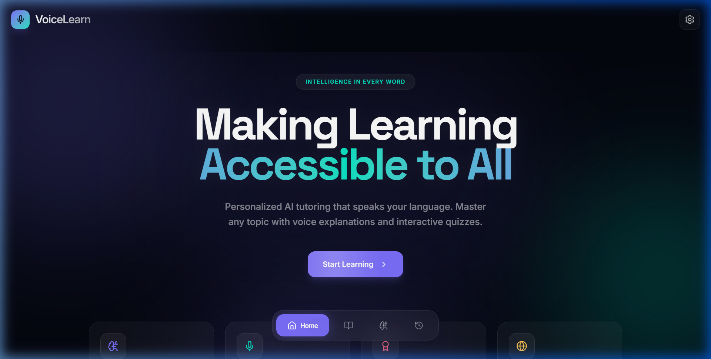

# VoiceLearn — AI Voice Tutor 🎙️🧠

VoiceLearn is a modern, full-stack educational platform that uses generative AI and high-fidelity text-to-speech technologies to explain complex concepts in multiple languages.

Users can choose their preferred AI model (Gemini, ChatGPT, or Claude), learn about *any* topic through personalized text explanations, listen to them spoken aloud natively via Murf AI, and immediately test their knowledge with AI-generated interactive quizzes.

 *(Preview)*

---

## ⚡ Tech Stack

### Frontend (User Interface)
- **Framework:** React 19 + Vite + TypeScript
- **Styling:** Tailwind CSS v4 + Framer Motion (for animations and glassmorphism)
- **Features:** LocalStorage BYOK key management, native HTML `<audio>` streaming, multi-step interactive UI.

### Backend (API & Data)
- **Framework:** Python Flask + Flask-CORS
- **Database:** SQLite (managed via SQLAlchemy 2.0 ORM) with tables for Users, Topics, Quizzes, and Voice outputs.
- **AI Integrations:** Google Generative AI (Gemini), OpenAI SDK (ChatGPT), Anthropic SDK (Claude), Murf REST API.

---

## 🚀 Setup & Local Development

VoiceLearn runs as a decoupled architecture. You need to run both the **Backend** and the **Frontend** simultaneously.

### 1. Backend Setup (Flask)
Open a terminal and navigate to the backend folder:
```bash
cd backend
```

Install the required Python dependencies:
```bash
pip install -r requirements.txt
```

Set up your secure environment variables (see the Security section below):
```bash
cp .env.example .env
```

Start the Flask server. It will automatically create the `voicelearn.db` SQLite database on first run.
```bash
python app.py
```
*The backend will be available at `http://localhost:5000`.*

### 2. Frontend Setup (Vite)
Open a **new** terminal instance at the root of the project:
```bash
npm install
npm run dev
```
*The frontend will launch at `http://localhost:3000`. The Vite development server is pre-configured to proxy all `/api/*` requests directly to your Flask backend, preventing CORS errors.*

---

## 🔐 Secure API Key Management

VoiceLearn utilizes a highly secure, hybrid "Bring Your Own Key" (BYOK) architecture to guarantee your API keys are protected.

### 1. Server-Side Environment Variables (Recommended for Production)
For production deployments, DO NOT expose keys in browser code. Instead, store them in the backend `.env` file:
```env
# backend/.env 
FLASK_SECRET_KEY=super-secret-key
GEMINI_API_KEY=AIzaSy...
OPENAI_API_KEY=sk-proj-...
CLAUDE_API_KEY=sk-ant-...
```
The backend automatically falls back to these secure server-side keys when processing user requests.

### 2. Client-Side BYOK Headers (For Testing/Flexible Use)
Alternatively, developers can input their proprietary API keys directly into the UI via the **Settings ⚙** modal. 

**How it works seamlessly and securely:**
- Keys are saved **only** within the browser's persistent `localStorage`.
- When an action is taken, the frontend attaches the keys exclusively to standard HTTP headers:
  `X-Gemini-Key`, `X-Openai-Key`, `X-Claude-Key`, and `X-Murf-Key`.
- The Flask Python server intercepts these headers and passes them exclusively to the respective AI provider.
- **Keys are never logged to the console, and never saved in the SQLite database.**

> **Note:** Only Murf AI text-to-speech requires the user providing their key explicitly, as there is no server-side fallback for voice synthesis in the current build.

---

## 📡 API Reference & Usage

VoiceLearn exposes the following modular REST API endpoints under `http://localhost:5000/api/*`. 

#### `GET /api/health`
Verifies backend status, the running application version, and the active presence of server-side AI keys.

#### `POST /api/explain`
Generates a multi-paragraph educational explanation mapped to the targeted skill tier and language.
- **Body:** `{ topic: string, level: string, language: string }`
- **Headers:** `X-AI-Model` (e.g. `'gemini'|'chatgpt'|'claude'`), plus the relevant `X-provider-Key`.
- **Response:** `{ explanation: "...", provider: "gemini" }`

#### `POST /api/generate-voice`
Feeds the generated explanation text into the Murf AI REST API using region-specific native voice IDs (e.g., `fr-FR-maxime` when French is selected).
- **Body:** `{ text: string, voiceId: string }`
- **Headers:** `X-Murf-Key` (required)
- **Response:** `{ audioUrl: "https://url-to-playable-mp3.com" }`

#### `POST /api/generate-quiz`
Auto-generates 4 topic-relevant, multi-choice questions to test the user's retention of the subject.
- **Body:** `{ topic: string, level: string }`
- **Headers:** `X-AI-Model` and the relevant `X-provider-Key`.
- **Response:** 
```json
{
  "provider": "claude",
  "quiz": [
    {
      "question": "What is the primary function of...?",
      "options": ["Option A", "Option B", "Option C", "Option D"],
      "correctAnswer": 1
    }
  ]
}
```
*All explanations, generated voices, and quizzes are automatically committed to the backend SQLite database for full user history.*
